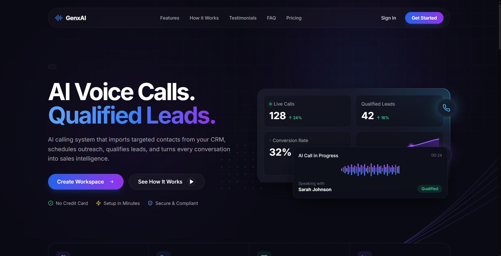
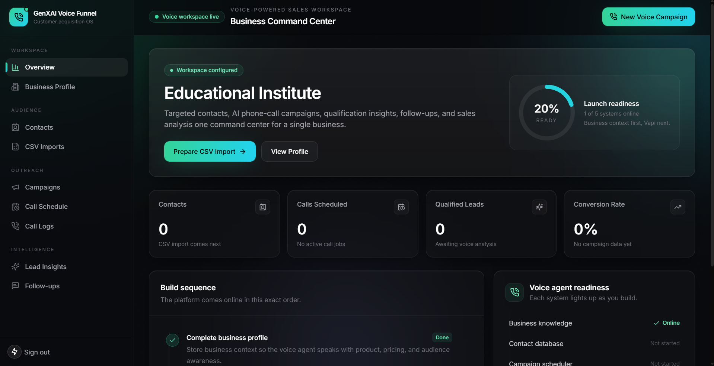
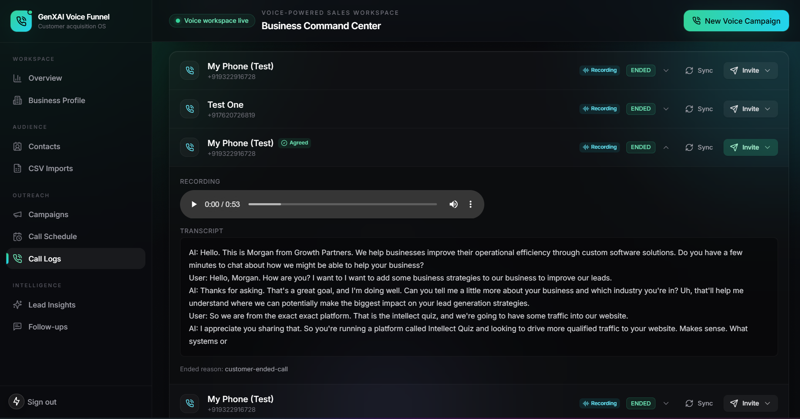
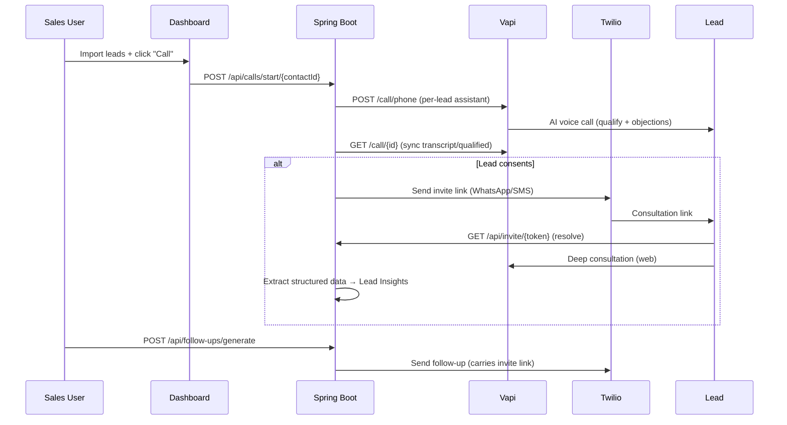

# 🚀 GenxAI  Voice Funnel
### Turn cold lists into qualified conversations. Automatically.

[](https://genxai-psi.vercel.app)





*(The Aurora Glass command center powering the entire voice funnel)*

---

## 📖 Table of Contents
1. [What is GenXAI Voice Funnel?](#-what-is-genxai-voice-funnel)
2. [The Funnel, End to End](#-the-funnel-end-to-end)
3. [Key Features](#-key-features)
4. [The AI Toolkit](#-the-ai-toolkit)
5. [How It Works (Backend Engineering)](#-how-it-works-backend-engineering)
6. [Tech Stack](#-tech-stack)
7. [Architecture & Flow](#-architecture--flow)
8. [Project Structure](#-project-structure)
9. [Installation](#-installation)

---

## 💡 What is GenXAI Voice Funnel?

**GenXAI Voice Funnel** is a voice-powered customer acquisition and sales-intelligence platform. You upload a list of leads, and an **AI voice agent — personalized to your business and tuned to an Indian-English female voice — calls each one**, qualifies them, handles objections, and (with consent) sends a personalized invite link over WhatsApp/SMS.

The lead then opens that link and completes a **deep on-platform voice consultation** that extracts their exact needs, services of interest, budget, timeline, and objections into structured data on your dashboard. From there, GenXAI drafts a personalized **AI follow-up** that carries the consultation link forward — closing the loop from cold number to qualified, ready-to-convert lead.

It's built on top of a battle-tested **async AI engine** (originally a 6-tool productivity suite), so every AI feature is fast, non-blocking, and grounded only in *your* business facts.

---

## 🔁 The Funnel, End to End

```
Import leads (CSV/Excel)
   → AI voice call  (per-business agent · Indian female voice · objection handling)
   → Qualify + capture consent
   → Invite link via Twilio  (WhatsApp / SMS)
   → Lead opens link → deep voice consultation
   → Structured-data extraction → Lead Insights dashboard
   → AI follow-up  (carries the consultation link as its CTA)
```

Each stage is its own service, entity, and set of REST endpoints, so the funnel is fully observable and resumable from the dashboard.

---

## 🛠 Key Features

- **📇 Lead Management:** Drag-and-drop CSV/Excel import with automatic header mapping; full contact CRUD with status tracking (New → Calling → Called → Invited → Qualified).
- **📞 AI Outbound Calling:** Real outbound phone calls via **Vapi**, with a system prompt built per-business *and* per-lead — knowledge, goal, qualification questions, guardrails, tone, and language.
- **🇮🇳 Indian Voice Agent:** Defaults to an Indian-English female neural voice, with Hindi and male variants selectable per business.
- **🛡️ Objection Brain:** An AI-generated objection-handling playbook (from your business profile) injected into every call so the agent handles pushback confidently.
- **🔗 Smart Invites:** On consent, a unique consultation link is sent over WhatsApp/SMS through **Twilio** — with auto-send on qualification.
- **🎙️ Deep Consultation:** A public, link-based voice consultation that extracts needs, services, budget, timeline, objections, and a recommended offer into structured JSON.
- **📊 Lead Insights:** Every consultation surfaces as a rich card with conversion probability and next-best-action.
- **✉️ AI Follow-ups:** Personalized follow-up messages drafted from call + consultation insights, with a one-click **Improve** polish, sent over WhatsApp/SMS.
- **🎧 Call Logs:** Recordings, transcripts, summaries, and live status sync straight from Vapi — no public webhook required.

---

## 🧰 The AI Toolkit

GenXAI's original productivity tools were repurposed to power the funnel — each one grounded in your business data instead of a blank text box:

| Original Tool | Repurposed As | Where It Lives |
|---|---|---|
| Email Writer | Follow-up generator (embeds invite link) | Follow-ups |
| Text Improver | "Improve" draft polisher | Follow-ups |
| Accurate Response | **Objection Brain** (live in calls) | Business Profile → Calls |
| Cover Letter | Personalized pitch *(roadmap)* | Lead Insights |
| Roadmap Generator | Campaign planner *(roadmap)* | Campaigns |
| Text Summarizer | Transcript/insight condenser *(roadmap)* | Call Logs / Insights |

---

## ⚙️ How It Works (Backend Engineering)

An **event-driven Spring Boot** core keeps the UI responsive even when AI and telephony are slow.

### 1. Async Job Queue
AI models take 5–15s to reply; blocking the HTTP thread destroys UX. The controller returns a **Job ID** instantly while a background `@Async` worker calls Gemini and writes the result — the frontend polls for completion.

### 2. Database-Driven Personas
System prompts live in PostgreSQL, not hardcoded in Java, so AI behavior can be patched without a redeploy. The newer voice/sales features build their prompts dynamically from each `Business` + `Contact`.

### 3. Provider Sync Without Webhooks
Outbound Vapi calls are tracked by polling `GET /call/{id}` server-side, so transcripts, recordings, qualification flags, and auto-invites work even on localhost without a public webhook.

### 4. Secure & Stateless
The API is secured with **Spring Security + JWT**; public funnel routes (`/api/invite/**`, `/api/vapi/webhook`) are explicitly opened, everything else is authenticated.

> ⚠️ Runs with `spring.jpa.open-in-view=false`; list queries that map DTOs use `@EntityGraph` to eagerly fetch associations and avoid lazy-loading errors.

---

## 💻 Tech Stack

### Backend (The Brain)
- **Framework:** Java 21, Spring Boot 3
- **Data:** Spring Data JPA + PostgreSQL
- **Security:** Spring Security + JWT
- **Voice:** Vapi REST (`/call/phone`, per-call assistant overrides, Azure neural voices)
- **Messaging:** Twilio REST (SMS + WhatsApp)
- **AI:** Google Gemini API
- **Async:** Spring `@Async` job worker, WebClient (WebFlux)

### Frontend (The Face)
- **Framework:** Next.js 15 (App Router, React)
- **Styling:** Tailwind CSS + shadcn/ui — custom **Aurora Glass** design system
- **Voice UI:** `@vapi-ai/web` + WebGL orb (`ogl`), framer-motion, sonner
- **Parsing:** SheetJS (`xlsx`) for CSV/Excel import
- **Deployment:** Vercel (frontend), Render/Docker (backend)

---

## 🏗 Architecture & Flow

The voice funnel, from imported lead to qualified follow-up:


```mermaid
sequenceDiagram
    participant User as Sales User
    participant FE as Dashboard
    participant API as Spring Boot
    participant Vapi
    participant Twilio
    participant Lead

    User->>FE: Import leads + click "Call"
    FE->>API: POST /api/calls/start/{contactId}
    API->>Vapi: POST /call/phone (per-lead assistant)
    Vapi->>Lead: AI voice call (qualify + objections)
    API->>Vapi: GET /call/{id} (sync transcript/qualified)
    alt Lead consents
        API->>Twilio: Send invite link (WhatsApp/SMS)
        Twilio->>Lead: Consultation link
        Lead->>API: GET /api/invite/{token} (resolve)
        Lead->>Vapi: Deep consultation (web)
        API->>API: Extract structured data → Lead Insights
    end
    User->>API: POST /api/follow-ups/generate
    API->>Twilio: Send follow-up (carries invite link)
```

---

## 📂 Project Structure

```
GenXai/
├── App/  (Frontend — Next.js 15)
│   ├── app/(dashboard)/        # contacts, imports, call-logs, lead-insights,
│   │                           #   follow-ups, campaigns, business-profile, dashboard
│   ├── app/invite/[token]/     # Public consultation page
│   ├── app/agent/voice/        # WebGL voice orb agent
│   ├── components/features/     # voice/ + workspace/ (Aurora Glass UI)
│   ├── hooks/                  # useVapi
│   └── lib/                    # apiClient, parseContactsFile (SheetJS)
│
└── backend/  (Backend — Spring Boot 3)
    └── src/main/java/com/genaibackend/aibackend/
        ├── controller/         # Contact, Call, Invite, Consultation,
        │                       #   FollowUp, Business, Vapi webhook, AI, Auth
        ├── service/            # VapiCallService, TwilioService, InviteService,
        │                       #   ConsultationService, FollowUpService, AIService
        ├── entity/             # Contact, VoiceCall, Invite, ConsultationSession,
        │                       #   FollowUp, Business
        ├── repository/         # Spring Data JPA repositories
        ├── dto/                # Request/response models
        └── config/             # Spring Security + JWT
```

---
